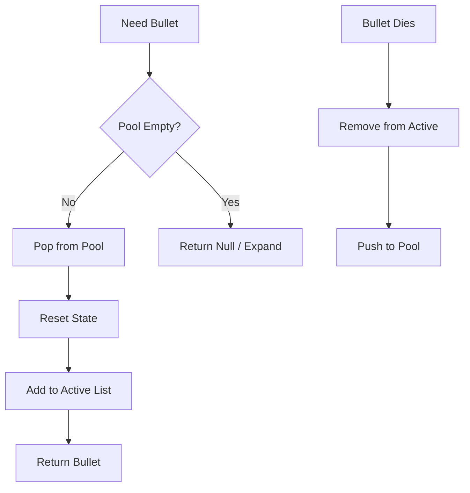

# Roadmap: Performance & Optimization

## 1. The "Garbage Collector" Spike (The #1 FPS Killer)

**The Problem**: The game freezes for 200ms periodically due to Garbage Collection (Stop-The-World) cleaning up thousands of short-lived objects (e.g., `new Vector2`, `new Bullet`).

**The Fix: Object Pooling**
Never use `new` inside the game loop. Pre-allocate reusable objects.

### Architecture
```typescript
class BulletPool {
    private pool: Bullet[] = [];
    private active: Bullet[] = [];

    constructor(size: number) {
        // Pre-allocate at startup
        for(let i=0; i<size; i++) this.pool.push(new Bullet());
    }

    get(x: number, y: number): Bullet | null {
        if (this.pool.length === 0) return null; // Or expand dynamically
        const b = this.pool.pop()!;
        b.reset(x, y);
        this.active.push(b);
        return b;
    }

    release(b: Bullet) {
        const index = this.active.indexOf(b);
        if (index > -1) {
            this.active.splice(index, 1);
            this.pool.push(b);
        }
    }
}
```



## 2. The "Sub-Pixel" Shimmer (The "Ugly Art" Bug)

**The Problem**: Pixel art shimmers or distorts because floating-point physics coordinates (x: 10.435) are anti-aliased by the browser canvas.

**The Fix: Floor on Render, Float on Logic**
Keep physics high-precision, but snap rendering to integers.

```typescript
// BAD
ctx.drawImage(sprite, this.x, this.y);

// GOOD (Crisp)
// Bitwise | 0 is the fastest floor in V8
ctx.drawImage(sprite, (this.x | 0), (this.y | 0)); 
```
*Note: Ensure Camera position is also floored before applying global transform.*

## 3. Asset Loading: Texture Atlases
**The Problem**: Loading 100 separate images causes 100 HTTP handshakes, leading to slow load times ("White Flash").

**The Fix: Texture Packer**
1.  Squash all frames into one big `hero_atlas.png`.
2.  Use a JSON file to define frame coordinates.
3.  **Zone Loading**: Load assets per "Room" or "Zone" (Menu, Tutorial, Boss) rather than all at once.

## 4. Audio: Game Feel
**The Pro Tip**: Good audio requires programmatic manipulation.
-   **Pitch Randomization**: Play SFX with playback rate `0.9` - `1.1` to prevent fatigue.
-   **Ducking**: Lower BGM volume programmatically when important SFX (Boss Scream) plays.

## 5. Bandwidth & Hosting
-   **Static Assets**: Host on Cloudflare Pages / GitHub Pages (Free).
-   **WebSocket Server**: Use **Bun.serve()** (faster than Node) on a small VPS (Hetzner/Fly.io).

