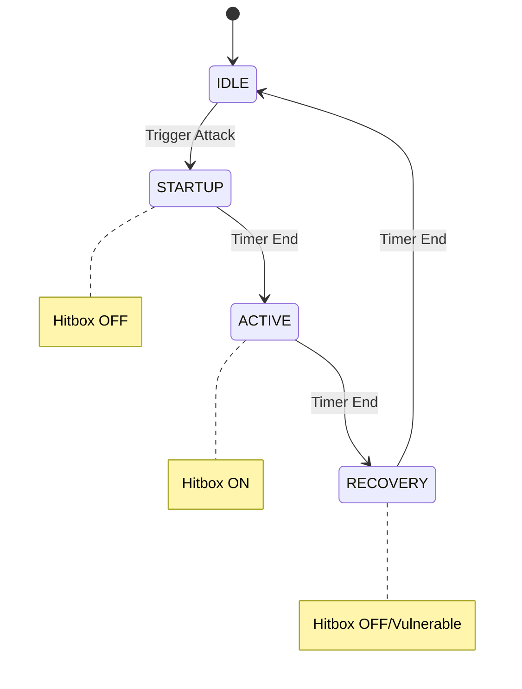

# Roadmap: Advanced Gameplay Systems

## 1. Boss Fights: HFSM / Behavior Trees

**The Problem**: Using `if/else` for complex boss patterns leads to "spaghetti code" and glitches.

**The Fix: Hierarchical Finite State Machine (HFSM)**
Separate **Decision** (Brain) from **Action** (State).

### The "Tell" Architecture
Every attack must strictly follow this sequence:
1.  **Startup (The Tell)**: 10-20 frames. Animation only. **Hitbox: OFF**.
2.  **Active (The Hit)**: 3-5 frames. Sword swings. **Hitbox: ON**.
3.  **Recovery (The Punish)**: 20-40 frames. Boss vulnerable. **Hitbox: OFF**.



## 2. Story & Dialogue: Externalize Narrative

**The Problem**: Hardcoding text (`if (npc) showText("Hello")`) makes localization and editing impossible.

**The Fix: External JSON / Yarn**
Use a `dialogue.json` and a **Flag Manager**.

```typescript
// flags.ts
export const WorldState = {
    met_hornet: false,
    defeated_boss_1: false
}

// Interaction
const dialogID = Logic.decideDialog(npc.id, WorldState);
UI.showDialog(dialogID);
```

## 3. Physics: Anti-Tunneling via Raycasting

**The Problem**: Fast-moving entities (dashes, bullets) skip over thin walls (Tunneling).

**The Fix: Raycasting**
For high-speed objects, do not check "Am I colliding now?". Check "Did the line from OldPos to NewPos intersect a wall?".

```typescript
// Conceptual
if (velocity.length() > width) {
    const hit = Raycast(oldPos, newPos, walls);
    if (hit) ResolveCollision(hit);
}
```

